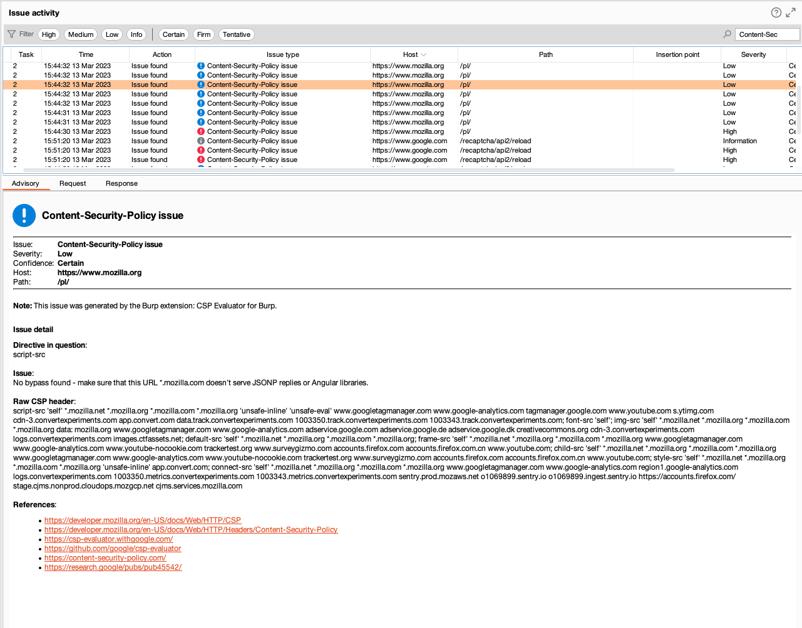

# CSP Evaluator for Burp

Burp extension (jython) based on [csp-evaluator](https://github.com/google/csp-evaluator) project from Google. All credits for basic evaluator logic go to the creators of this project.

## How to install?

1. Clone this project with git
2. Go to the Extensions tab in Burp Suite
3. Click add and select `Python`
4. Find the [CSPEvaluatorBurp.py](./CSPEvaluatorBurp.py) file locally and load it by selecting the mark next to the name of the extension
5. Wait for it to load and have fun

## How does it work?

There are two implementations of this project:

- active scanning
- passive scanning

Issues are found automatically in the background when you search the web via built-in chromium browser and during active scanning. New entries will pop-up in issues tab in the Dashboard.

<figure>      <figcaption>
<i>Issue tab in Burp's Dashboard with an example passive scan on mozilla.org</i>
</figcaption> </figure>
